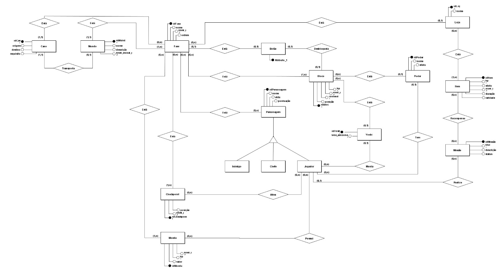

## Introdução

O Diagrama Entidade-Relacionamento (DER) é uma representação gráfica composta por diversos elementos que descrevem os componentes do modelo Entidade-Relacionamento, como entidades, atributos (incluindo chaves), relacionamentos e restrições estruturais.

Esse diagrama oferece uma perspectiva lógica do banco de dados, permitindo uma compreensão ampla e organizada da estrutura de dados de um sistema.

### Versão atualizada

Figura 1: Diagrama Entidade Relacional 3.0 Super Mario Bros

  
Versão 1

  
  Figura 2: Diagrama Entidade Relacional 1.0 Super Mario Bros

